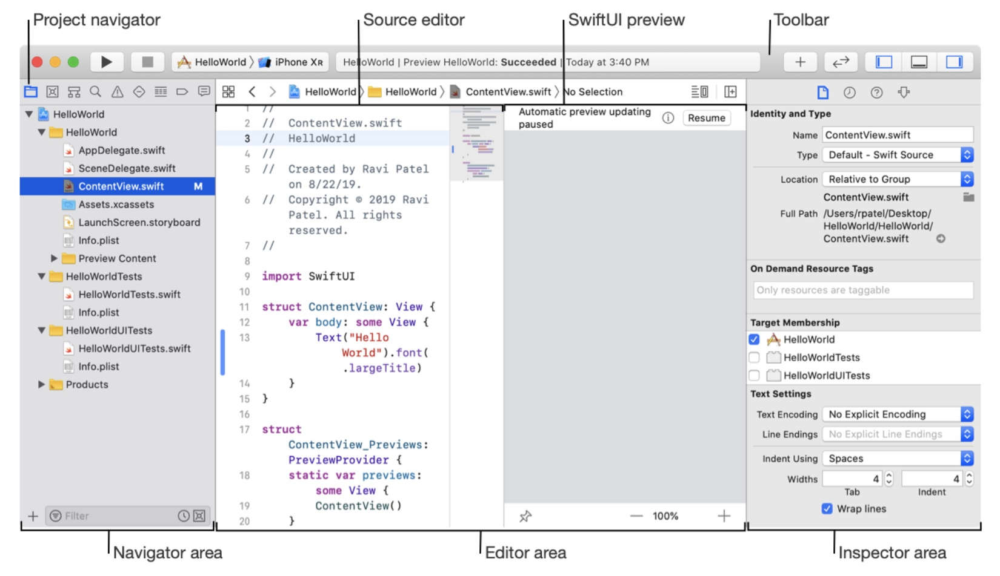
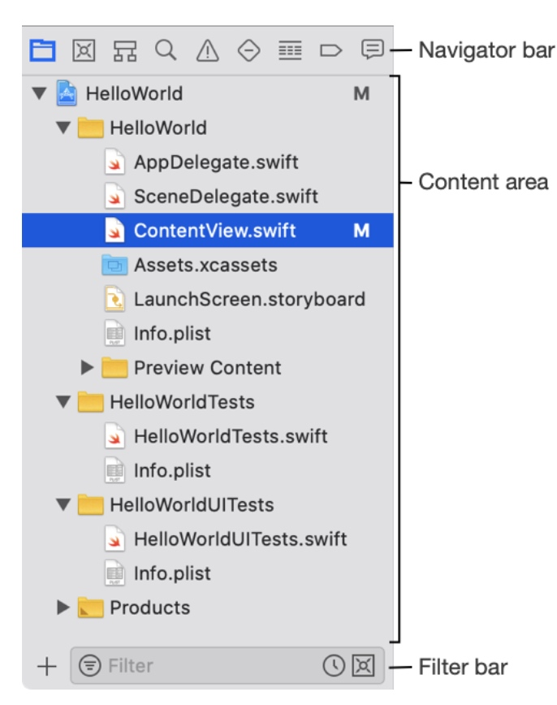
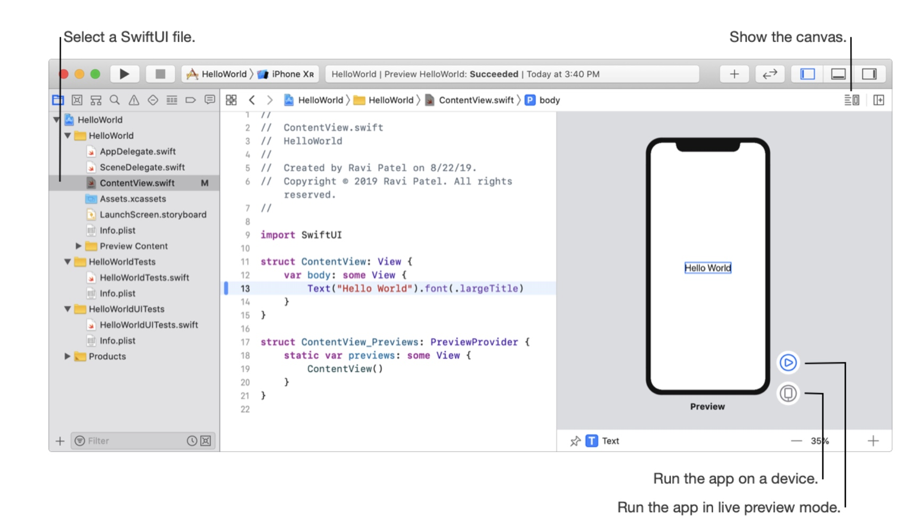
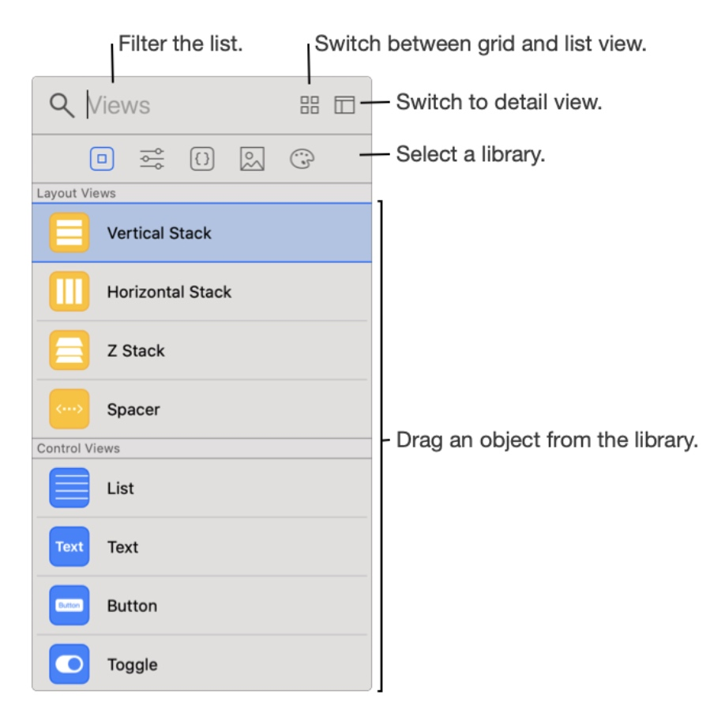
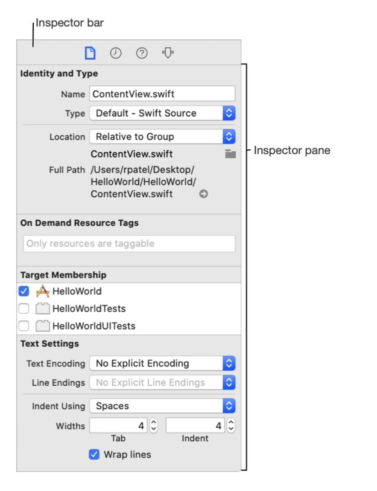
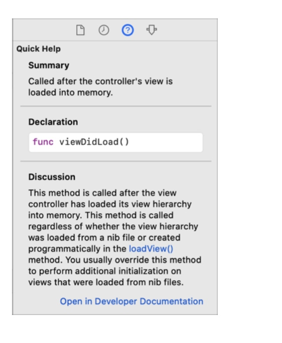
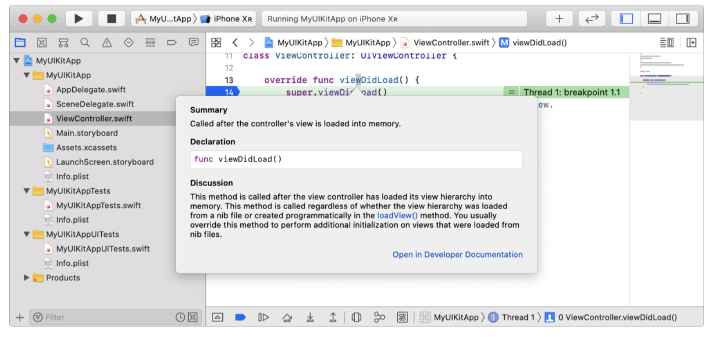
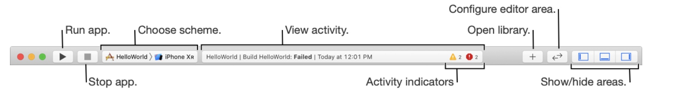
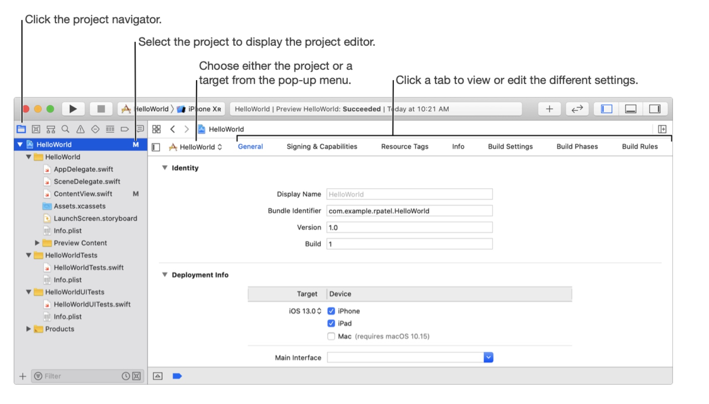

# 欢迎来到Xcode
注意: 对于Xcode12.0以及更新的版本请查看Xcode在Apple Developer官网上的文档。

Xcode是Apple公司的继承开发环境(IDE)。你可以使用Xcode为苹果的产品，比如iPad，iPhone，Watch，TV和Mac，构建应用(Apps)。Xcode提供一些工具去关联整个开发的流程，
从创建App到测试，优化，上传到App Store。

将项目将需要的文件和资源组织起来去开发你的App，从模板中去选择一个开始创建项目，然后去修改模板按照你喜欢的样子。模板可以被获取从每个平台上(iOS, watchOS, tvOS, macOS)多种类型如Apps，框架，库。每一个模板都被预先默认设置的并每个模板是可以被构建运行的。

为了去在布局界面和编辑代码时看到交互预览，我们选择Swift作为编程语言，选择SwiftUI作为用户界面。

在创建了一个项目后，主界面将显示出来，这个界面是你查看、编辑、管理你项目每一部分的主要界面。它是灵活的可以配置去适应任务的需求，并且你可以配置他去满足你的工作风格。

使用导航区域（）快速的获取到你的项目的不同部分，随着点击在导航栏上的按钮在内容区域展示相应的部分

举个例子，选择一个使用SwiftUI的蚊香在项目的项目导航中去打开它，在代码编辑区将显示源代码编辑，点击重现运行在预览视图的右边，Xcode保持代码和在右边的交互预览是同步的，使用控制在canvas去运行App在模拟器上(使用或者不使用debug session)或者运行App到已经连接的设备上。debug session 在编辑区的下面debug区域被显示.

要使用现成的资源，点击在工具链上的库按钮(+)然后选择资源去添加，比如选择Views库去获取到标准的UI元素，拖动你想要的元素从库到Canvas或者到源代码编辑区上，无论你从哪里改变Xcode将保持预览视图和源代码同步。

使用检查区域来查看编辑你在导航或者编辑区选择的对象的信息，点击相应的按钮在检查条来展示检查信息，比如在代码编辑区域或者预览视图区域选择用户界面元素，然后选择View -> Inspectors -> Show Attributes Inspector 改变值在检查区域，Xcode将更新源代码和预览视图。同样你也可以按住Command在源代码中或者预览视图中点击元素去改版属性在弹出的视图中。

查看关于符号的描述，UI对象，构建设置你选择在标记区域的，点击 Quick Help inspector 在审查条上 或者选择View > Inspectors > Show Quick Help Inspector 展示丰富的文档对于你选择的符号，点击打开开发者文档链接在底部。

注意按住Option在代码编辑器中点击符号(按住Command点击符号或者选择choose Show Quick Help)在弹出的视图中查看简要的描述，按下空格或者点击界面的其他位置以取消掉弹窗。

使用toolbar来构建运行你的App，查看运行任务的过程，设置你的工作环境，你将从计划表中选择一个运行的目标,比如模拟器或者设备，使用位于导航栏右边的分段控制器来显示或者隐藏导航, debug, 和检查区域的主界面。

选择项目文件(在根的文件在项目导航上)来打开项目编辑器，使用这个编辑器来查看编辑你的项目或者其他设置，使用tabs标签来切换不同类型的设置，比如点击Signing & Capabilities，将展示代码签名，需要运行的设备，开启那些Apple提供的能力。

